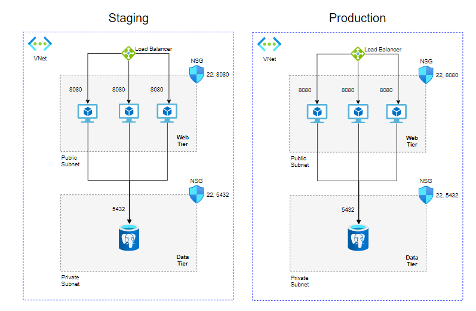

 
This Terraform moudule enables you to build this system:

With additional machine to run ansible and configure the other machine.

# how to run this project?
## Requriments
1. [Terraform](https://learn.hashicorp.com/tutorials/terraform/install-cli)
2. Azure account
3. [Azure CLI](https://docs.microsoft.com/en-us/cli/azure/install-azure-cli)

## Steps to run the project:
1. Conncte your Azure CLI to your Azure accont-`az login`.
2. Add a directory named `vasrsFiles` to the project directory.
3. Add the files `production.tfvars` and `staging.tfvars` to the `vasrsFiles` directory.
    3.1 Each tfvars file should contain this information:
    ```
    prefix="<enviroment prefix>"
    webAppMachines_username="<username>"
    webAppMachines_password="<password>"
    ansible_username="<username>"
    ansible_password="<password>"
    machines_ammount="<number of machines in the enviroment>"
    pg_user="<postgress user name>"
    pg_pass="<postgress password>"
    ipToconnetAnsibleWorkStation="<your ip>"
4. Run the command `terraform init`.
5. The staging resource will be connected to the `default` Terraform workspace.
so you can run the command `terraform apply -var-file varsFiles/staging.tfvars` to build the staging system.
6. Run `terraform worspace new production` to build the production system.
7. Run the command `terraform apply -var-file varsFiles/production.tfvars` to build the production system.
8. In Azure portal get the pulic IP of the machine where you run ansible.
9. You can use the ansible project to run the Weight Tracker app on your enviroment.

# Terraform backend on azure storage
To upload the terraform state to azure storage, you need to cancel the comment inside the "backetStateConfiguration.tf" file.
And change the storage attributes names to your own.

You need to run `terraform init` again, to apply the backend configuration.

# More details
You can read more details about this terraform module in the automated documentation:
[Terraform-docs](./moduleDetails.md)